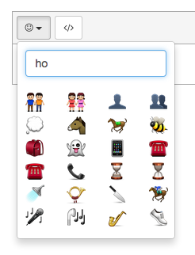

修改自: <https://github.com/nilobarp/summernote-ext-emoji>
那个没法用（后来发现少了个css文件），改了下，保留了一些常用表情

使用方法如下
引入src中的summernote-ext-emoji.js（注意要放在summernote核心js文件后面）

document.emojiSource = '../pngs/'; //表情图片所在目录
$('#summernote').summernote({
  toolbar: [
		['misc', ['emoji']],
		['code', ['codeview']]
	]
});

--------------------------------------------

# Summernote emoji plugin



##Usage

 - Include `summernote-ext-emoji.js`
 - Add `emoji` to summernote toolbar

##Example

```html
<textarea id="summernote"></textarea>
```

```javascript

document.emojiSource = '../pngs/'; //relative path to emojis

$('#summernote').summernote({
  toolbar: [
		['misc', ['emoji']],
		['code', ['codeview']]
	]
});
```
